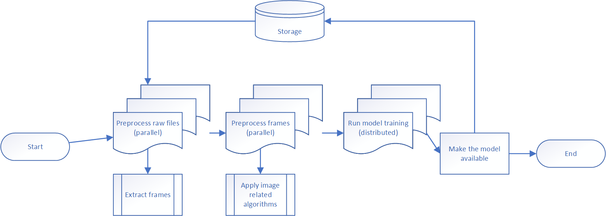
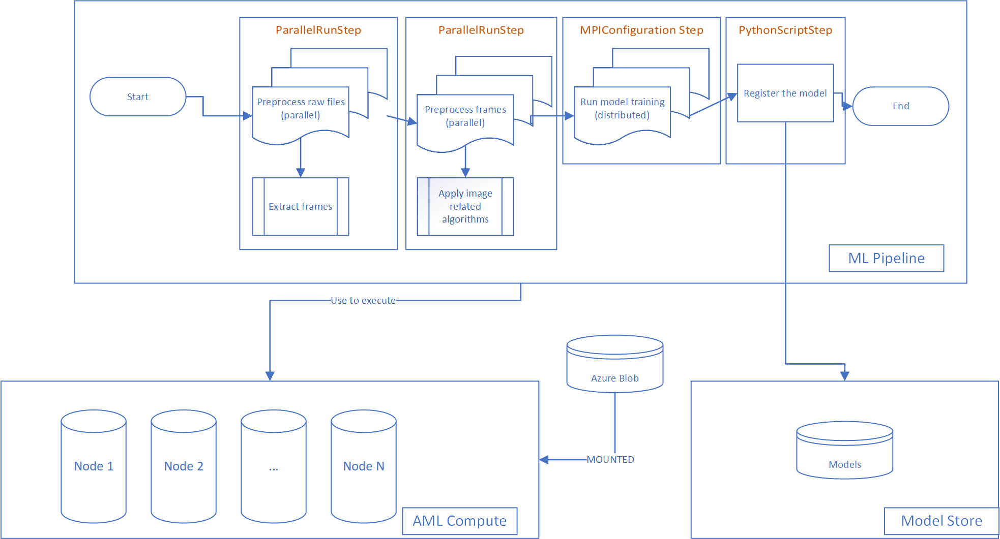
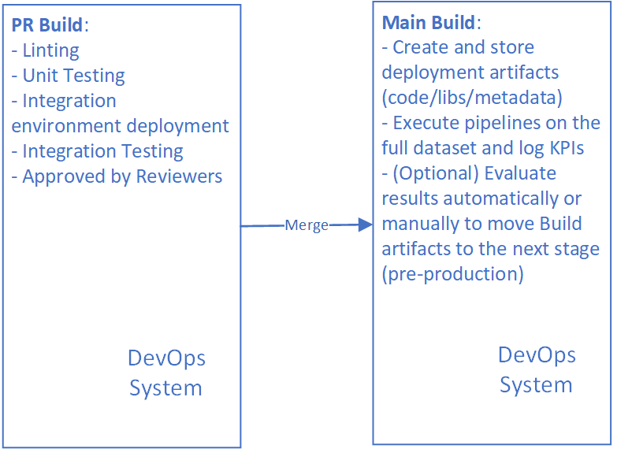
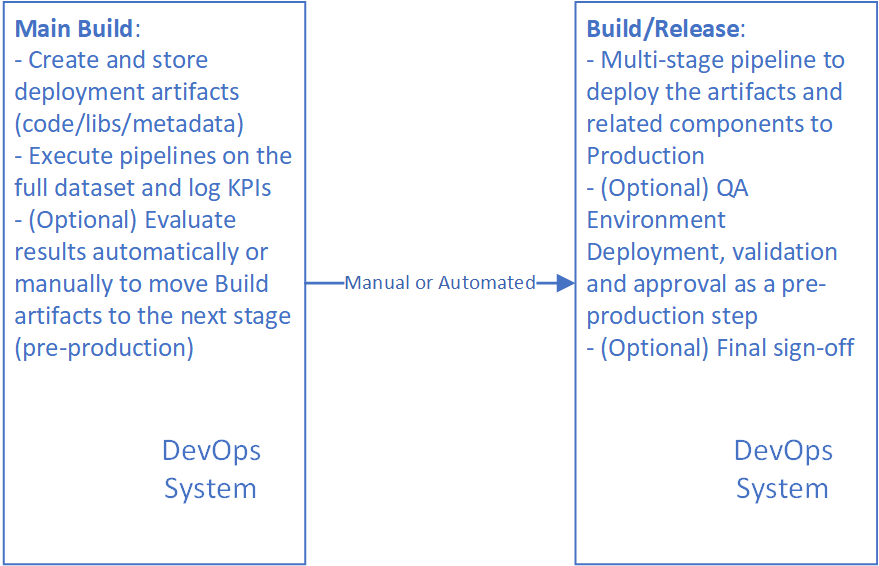
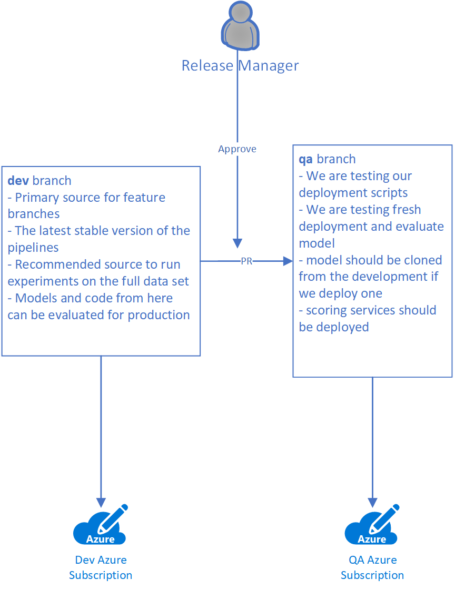
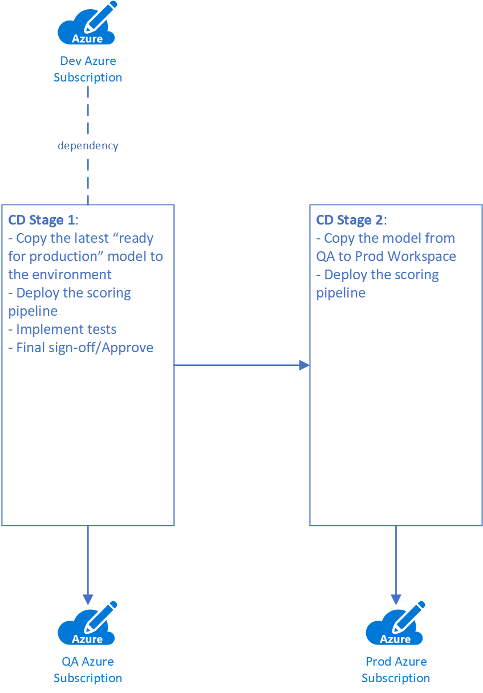
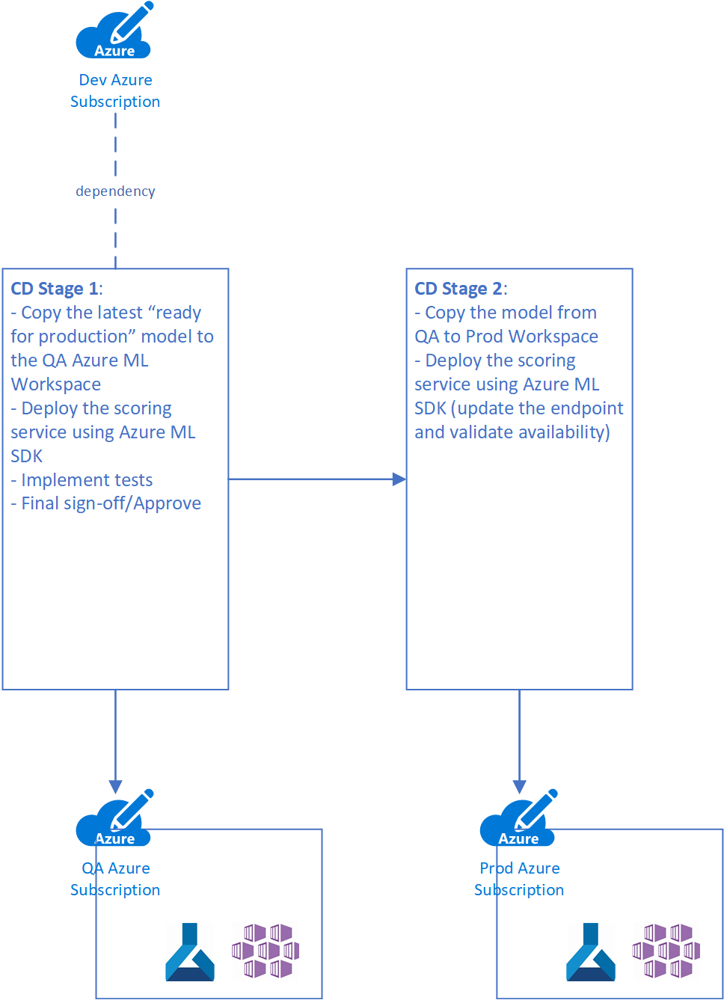

# MLOps Architecture #

MLOps: development and operations for Machine Learning or a way how to develop machine learning pipelines in a big team and deploy them to production alongside models.

The primary goal of this document is to show how to implement MLOps process in a project starting from scratch. We are planning to explain the roadmap as well as support it by referencing some real good examples to make sure that you have all needed components and tools to start. Let’s start the explanation by defining some terms and artifacts.

## Machine Learning Pipelines ##

### Primary development artifacts for MLOps process ###

There are several artifacts that we are touching in MLOps:

- Machine Learning pipelines
- Training and Scoring datasets
- Models

The primary one is Machine Learning pipeline.

The model files themselves are less important since we can always train a new model executing our pipeline. If we use the same dataset and same configuration of hyperparameters, the pipeline can recreate the model on demand.  At the same time, we need to care about how to move models from the development environment to production, and it’s something that we are going to cover in the last section of the document.

Datasets are important from many different perspectives including traceability, data labeling, and data drift detection. At the same time each of these topics is complex and requires a separate guideline that doesn’t affect MLOps process for ML pipelines much. So, we will just assume here that we have a dataset in a fixed location and it’s immutable and it’s possible to pass information about the dataset to the ML pipeline as a parameter. If we would like to compare performance and execute our pipeline on several different datasets, we will just pass different parameters.

Therefore, the current document is about the Machine Learning pipelines. Let’s discuss what an ML pipeline is.

Usually, we treat Machine Learning pipeline as a process that should generate a new model at the end, but in general, it can be any process that uses machine learning patterns and practices or a part of bigger ML process. It’s common to see data preprocessing pipelines, scoring pipelines for batch scenarios and even pipelines that orchestrate training based on cognitive services. Therefore, we will understand **ML pipeline** as a set of steps that can be executed sequentially or in parallel, where each step can be executed on a single node or use a set of nodes to speed-up some tasks. The pipeline itself defines not just the steps but a compute(s) where the steps should be executed, related datasets and data stores. So, usually a pipeline implementation sticks to a particular set of technologies.

Let’s look at the example: imagine that we need to train a model find some anomalies in raw video frames (bad pixels). In real life it’s not common to have a ready to use dataset right away. It means that you have to implement a preprocessing step(s). For example, if input dataset is a number of raw video files, they have to be separated into frames first, and some additional algorithms can be applied to each particular frame. So, you need to do some tasks to prepare the dataset, ballance it, extract features and so on. Right after that you can use any ML framework to execute training. Implementing the pipeline, you should not be surprised that the pre-processing block takes much more time compared to the training itself. At the same time, we can run pre-processing for files and for images using several compute nodes at the same time. It gives us a signal to split our pipeline into several different steps and execute each of them in a different environment (e.g., on a cluster with a number of nodes compared to a single node cluster or GPU nodes versus CPU nodes). If we use a diagram to design our pipeline, it can look like this:



You can see that we have four sequential steps there. We are executing first step in parallel on several nodes to convert all available video files into images. The second step is running in parallel as well, but it can be a different number of nodes because we have much more images to pre-process compare to the number of videos. One more step is training itself and we can use distributed approach there (like Horovod or Parameter Server). Finally, we have a single node step to log the model into the storage.

Therefore, it should be clear why we need to build pipeline rather than a single script that represents our experiment. Let’s discuss technologies.

### Azure Machine Learning service to manage primary artifacts ###

Microsoft offers a service to develop and manage our primary artifacts: Azure Machine Learning service. The following are the most important components that are useful for pipeline implementations:

- **Azure ML SDK for Python**: to create all Azure ML components and communicate to Azure ML service
- **Azure ML Compute**: a service that allows us to create and manage clusters to execute pipeline steps there. It can be just one cluster for all steps or different clusters per step. There is a way to mount storage to compute cluster instances, and we are going to use this feature implementing our pipeline steps
- **Azure ML Model Repository**: Azure Machine Learning support a special API to register and manage models. A model is a single file or a folder with a set of files. There is a way to track versions
- **ML Pipeline SDK (as a part of Azure ML SDK)**: Using Azure ML SDK we can define our training pipelines including steps and their configuration, compute cluster parameters, sequence and so on
- **ParallelRunStep and PythonScriptStep**: valuable classes from Azure ML SDK in the most of pipelines to execute code in parallel or on a single instance. There are some additional step types such as MPI training or training on Databricks

Let’s show how our example from above will look like from technologies perspective:



### How ML Pipelne is evolving and there is a connection point with data scientists ###

It’s not a surprise that data scientists prefer to use Jupyter Notebooks to do their experiments. We don’t see any sense to limit their creativity and ask them to implement Azure ML pipelines from the beginning. There are several reasons to do that:

- Not every Jupyter notebook is going to be a pipeline in production: in some case data scientists need to test many different approaches and ideas to pick one
- It’s too hard to design a pipeline and all steps in the beginning of the project since you don’t know the most of critical blocks and the final split into steps can be unstable

So, initial experiment can be done in a notebook, but there are several signals that show the point in the time when you need to start moving experiments from a notebook to Azure ML Service:

- The pipeline is stable, and we can move it from the research phase to the development stage
- Data scientists would like to execute the same pipeline with different parameters at the same time
- Data Scientists needs additional compute resources since the pipeline on a single VM or a local computer takes too long to execute

Once you can see any of these signals, it’s time to wrap experiments using Azure ML Pipeline SDK. We would recommend doing it using three-steps approach:

- **Step 1. Prepare your notebook doing refactoring.** The primary goal of this step is to move all methods/classes to separate Python files and make them independent from the execution environment
- **Step 2. Convert existing notebook to a single step pipeline.** You can use the following guideline to create a single step pipeline that will be executed on a single instance only. The only difference is that it will be your own code in `train.py`. At this stage you will be able to see how the pipeline works and define all datasets/datastores and parameters if needed. Starting from this stage you are able to run several experiments of the pipeline using different parameters
- **Step 3. Identify critical blocks in your pipeline and move them to different steps.** The primary reason for this step is to make your pipeline faster. So, you need to understand the most common classes from Azure ML SDK including: **PythonScriptStep**, **ParallelRunStep** and others. You just need to identify your clusters (GPU or non-GPUs and VM sizes) and pick a class to wrap your step (single, parallel or TF/PyTorch related).

That’s all about the pipelines. Now, let’s discuss how to implement the development process for ML pipelines.

## Development process implementation ##

From a DevOps perspective the development process can be divided in three different stages:

1. Publish and Execute a pipeline from a local computer (or VM) using the full dataset or just a subset of data. Usually, it’s happening from a local feature branch where a developer or a data scientist is tuning the pipeline. Note that we are executing the pipeline from a local computer rather than on a local computer
2. Create and validate Pull Request for changes from a feature branch towards to the development branch
3. Publish and execute the pipeline in the development environment based on the full dataset

From implementation perspective our pipeline can be represented by a single Python file (for example, create_training_pipeline.py) that is referencing all needed code and creates steps. It’s not a problem to build this file in a way when you can reuse it in all three stages from above. There are a few pieces of advice that we can provide:

- Host all different parameters that are required for pipeline publishing as environment variables. In this case you will be able to initialize your local environment and publish the pipeline from a local computer or you can use a variable group in your favorite DevOps system to publish the pipeline from there
- Invoke the pipeline publishing script as a module. In this case you will be able to import any code for your steps without any workarounds. Look at the following example: `python -m ml_service.pipelines.diabetes_regression_build_train_pipeline`
- Use .amlignore to reduce number of files that you are submitting to Azure ML Service with your pipeline. This file has the same syntax as .gitignore

### Branch name utilization ###

The biggest challenge of the ML pipeline development process is how to modify and test the same pipeline from different branches. If we use fixed names for all experiments, models and pipeline names, it will be hard to differentiate own artifacts working in a big team. To make sure that we can locate all feature branch related experiments, we are planning to use feature branch name to mark all pipelines and experiment runs using it in experiments and artifact naming. In this case, it will be possible to differentiate pipelines from different branches as well as help data scientists to log various feature branch runs under the same name.

The designed scripts can be utilized to publish pipelines and execute them from a local computer or from a DevOps system. Below is an example how you can define Python variables based on initial environment variables as well as on a branch name:

```py
pipeline_type = os.environ.get('PIPELINE_TYPE')
source_branch = os.environ.get('BUILD_SOURCEBRANCHNAME')

model_name = f"{pipeline_type}_{os.environ.get('MODEL_BASE_NAME')}_{source_branch}"
pipeline_name = f"{pipeline_type}_{os.environ.get('PIPELINE_BASE_NAME')}_{source_branch}"
experiment_name = f"{pipeline_type}_{os.environ.get('EXPERIMENT_BASE_NAME')}_{source_branch}"

# Azure ML has strong limitations
# experiment name cannot be more than 36 symbols
# model name cannot be more than 30 symbols
if len(experiment_name) > 36:
    experiment_name = experiment_name[0:36]
if len(model_name) > 30:
    model_name = model_name[0:30]
```

You can see that in the code above we are using branch name as well as pipeline type. The second one is useful if you have several pipelines. To get a branch name from a local computer you can use the following code:

```py
    git_branch = subprocess.check_output("git rev-parse --abbrev-ref HEAD",
                                         shell=True,
                                         universal_newlines=True)
```

### Pull request builds ###

Let’s start with introduction of two branch types that we are going to use in the process:

- **Feature branch**: any branch owned by a developer to develop a feature. Since we are not planning to preserve and manage this branch, the developer has to decide how to name it
- **Development branch**: it’s our primary source for all feature branches and we treat it as a stable development environment that we are using to run our experiments on the full dataset. Potentially, the development branch as well as a current model there can be a good candidate for production at any point of the time

So, we need to start with a feature branch. It's important to guarantee that all code that is going to development branch can represent working ML training pipelines. The only way to do that is to publish the pipeline and execute the pipelines on a toy data set. The toy dataset should be prepared in advance and it should be small enough to guarantee that the pipelines don't spend much time for execution. Therefore, if we have changes in our ML training pipeline, we have to publish it and execute it on the toy dataset.


The diagram above demonstrate the process that we explained in the section. Additionally, you can see that there is a Build for Linting and Unit Testing. This Build can be an additional policy to guarantee code quality.

Pay attention that if you have more than one pipeline in the project, you might to implement several PR Builds there (one Build per pipeline, if it's available in your DevOps system) Our general recommendation is to have as many Builds as many pipelines we have. It allows us to speed-up development process since developers should not wait for all experiments to be done. In some cases it’s not possible.

### Development branch Builds ###

Once we have code in our development branch, we need to publish modified pipelines to our stable environment, and we can execute it to produce all required artifacts (models, update scoring infrastructure etc.)



Pay attention that our output artifact on this stage is not always a model. It can be a library or even our pipeline itself if we are planning to run it in production (scoring one, for example).

Let's see how to implement deployment to production depends on the artifact type.

## How to move deployment artifacts to production ##

There are two ways to make deployment to production:

- Implement CI/CD pipelines on your development branch to deploy qa and production environments
- Use several branches to move code from development to qa and production environments

Let's discuss both ways.

### CI/CD on the development branch ###

This approach is the most common one in the case if we can prepare all needed artifacts in advance (models and libraries), store them somewhere and mark as **production ready**.

For example, if we execute training from our development branch on the full dataset and we are getting a model, the model should be evaluated and approved. Once it's done, we will be able to mark the model using a special custom attribute (like **production** tag) and executing CD part we will use **the latest model with production tag**. In this case we don't care much about our code in the development branch because we are not planning to use it in production, we use it just to do training in our development environment.

Rollback strategy can be implemented with no challenges: we just need to remove tag from the latest model and execute the CI/CD again to pick up the previous version that is ready for production.



In the case of this implementation it's OK to use just one branch (**main**, for example) as the primary source for development and executing CI/CD.

### Multi-branch strategy ###

You can use several branches to move your code from development to production. This strategy works fine if you deploy code itself, don’t update the production environment often and have several versions of the production environment (for different partners or departments)

In the previous sections we have introduced two kind of branches: feature branches and the development branch. Both of them are designed to support development rather than production, and we are building MLOps processes just around these branches. At the same time, we cannot treat the development branch as a production. The branch is stable, but moving it to production “as is” might cause some issues. For example, we can have updated training pipelines, but no model exists based on it yet. Another example, somebody could activate a wrong model to be used in scoring service that is not critical for development branch, but critical for production.

That's why we propose to have a flow moving development branch to production using two stages:

- once we believe (data scientists should make this decision) that the current version of the development branch is ready for production, we are moving code alongside with the current model to a special QA branch. This branch is going to be used for testing to double check that our code and the models works fine. Additionally, we can test our deployment scripts there
- once all tests on the QA branch have been completed successfully, we can move code and the models from the QA branch to the production one

The reason to use branches rather than tags is ability to execute some additional DevOps pipelines prior to commit code from one branch to another. In these pipelines we can implement approval process as well as move ML pipelines between environments.

The PR Build on the movement from development to qa branch should include the following tasks:

- Deploy just needed infrastructure for production. In the most cases you don’t need to deploy your pipelines at all since you are not doing training in production environment. So, you can deploy just scoring infrastructure
- Copy all latest approved models (approved models can be tagged)



Implementing this process we are working across several branches:

- **dev**: the development branch as the default stable branch for developers
- **qa**: QA branch to test scoring pipeline and the model
- **main**: the source branch for production environment

Once we finish testing for our qa environment, we can create another PR and start a process to move everything to main. The PR should be approved and it will trigger the deployment Build that has to update scoring infrastructure in the production environment and clone our model again.

### Model Deployment ###

There are two the most common scenarios for model usage in production:

- batch scoring: in this case we use the model together with another ML pipeline to run it under Azure Machine Learning umbrella
- runtime service: in this case we need to understand a service to serve our model (like Functions, AKS, App Service, a custom service), pack the model to an image alongside with all needed components and make the deployment

Picking one or another scenario you can define what kind of components you need to have in the QA and Production environments.

In the case of the batch scoring, Azure Machine Learning service is a mandatory components that you are going to use to run the scoring pipeline. Pay attention that scoring pipeline is just one more pipeline that has to be supported in the development environment as well following all guidelines that we provided above. Implementing CD pipeline for the production environment you usually have to implement two steps: copy the latest **ready for production** model to QA/Prod environment and publish the scoring service to the appropriate Azure ML Workspace.



In the case of the runtime service Azure ML Workspace is an optional component in the QA/Prod environment, and it depends on a way how you are planning to use the model. There are several ways:

- You are using model as a separate entity in any kind of external application: in this case we just need to copy the model to a known location in QA/Prod environment to make it available for all consumers. Azure ML Workspace is not needed in this scenario
- You are deploying a model as a part of a custom image to serve in any service that is not connected to Azure ML: in this case you need to create an image and deploy it to the desired service. It's OK to use Azure ML related Container Registry in the Dev environment or any other ACR
- Finally, you can use the recommended way to serve the model - AKS that is attached to Azure ML service. In this case, you need to replicate Azure ML Workspace as well as AKS in each environment to follow the best security practices making sure that AKS computes in both environments are totally isolated


